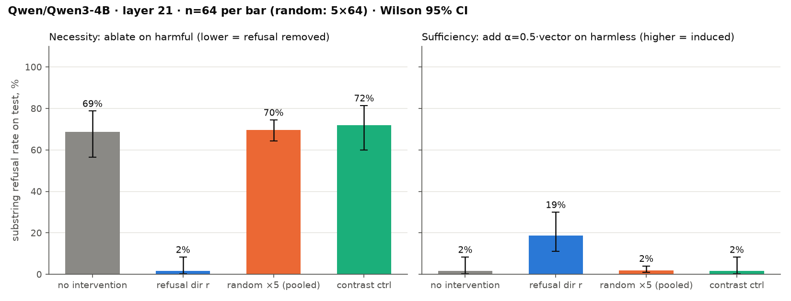
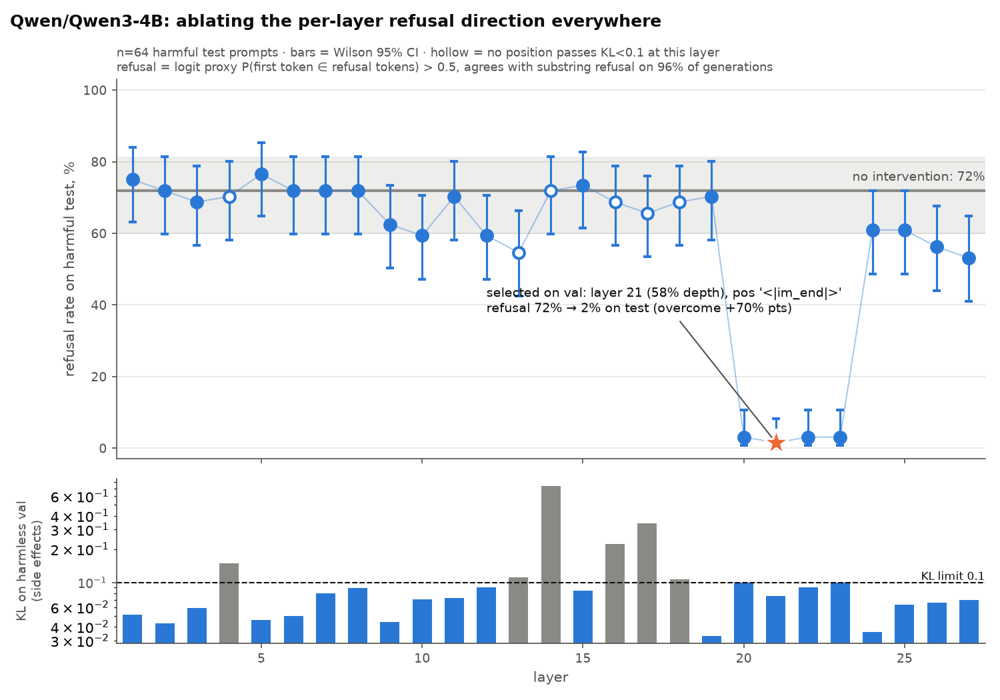

# interp-refdir

**Refusal in a chat model is mediated by a single direction.** A replication of
[Arditi et al. 2024](https://arxiv.org/abs/2406.11717) on Qwen3-4B, with two families of
control vectors and an LLM judge validated against blind hand labels.

One direction `r` in the residual stream — the difference in mean activation between harmful
and harmless instructions — controls refusal in both directions. Removing it makes the model
answer requests it otherwise declines; adding it makes the model refuse to suggest smoothie
ingredients. Neither effect appears for control vectors.

## Result

Held-out test prompts, judge-labeled, n=64 per condition (random controls pooled over 5
seeds), Wilson 95% intervals. Direction read from layer 21 of 36, at the post-instruction
token:

| Test condition | Ablate on harmful | Add on harmless |
|---|---|---|
| no intervention | 86% [75–92] refusal | 0% [0–6] refusal |
| **`r`** | **5% [2–13]** | **98% [92–100]** |
| 5 norm-matched random vectors | 88% [84–91] | 0% [0–1] |
| contrast-direction control | 88% [77–94] | 2% [0–8] |



- **Necessity and sufficiency both hold**, with intervals that do not overlap either control.
- **No collateral damage:** ablating `r` on harmless prompts leaves 64/64 compliance, and the
  judge labels one response in 1088 as incoherent.
- **Specific to harmfulness:** ablation strips 15.3% of ‖h‖² on harmful prompts but 0.25% on
  harmless ones. Random directions remove ~0.01% (≈ 1/d, as theory predicts for an isotropic
  direction); the contrast control removes 0.8%, with `cos(contrast, r) = 0.07`.

The effect is confined to layers 20–23. The lower panel is the side-effect guard — KL between
the clean and ablated next-token distributions on harmless prompts — which stops the sweep
from "removing refusal" by simply breaking the model:



Full method, diagnostics and caveats:
[`experiments/refusal_direction/`](experiments/refusal_direction/).

## Method in brief

| | |
|---|---|
| Data | Arditi et al.'s splits: 128+128 train (direction only), 32+32 val (all selection), 64+64 test (reported numbers), deduplicated |
| Direction | `mean(harmful) − mean(harmless)` at the input of layer *l*, position *p* |
| Selection | 9 post-instruction positions × layers below 0.8·L, scored on val with a one-forward-pass logit proxy |
| Ablation | `h − (h·r̂)r̂` at embed and every attn/mlp output, so no component can write `r` back at a later layer |
| Addition | `h + α·r` at one layer, every position including generated tokens |
| Controls | 5 norm-matched random vectors; a *contrast* direction built the same way from a harmless contrast with no refusal in it |
| Metrics | LLM judge (`refusal` / `compliance` / `incoherent`), validated at κ = 0.93 on 61 blind hand labels |

Train is AdvBench/TDC/HarmBench, test is mostly JailbreakBench — so the reported numbers also
show the direction transferring across prompt sources.

## Three things that would have produced a wrong answer

Each of these bit during the work, and each is now a guard in the code:

- **"Refusal is gone" also describes a broken model.** An early run picked a direction with
  KL = 15 on harmless prompts: it destroyed the model, which indeed stopped refusing. The KL
  filter is now never dropped, and `incoherent` is a separate judge label — at α=4 the model
  degenerates to 100% incoherent, which a refusal-only metric reads as "no effect".
- **A judge that fails silently zeroes every rate.** One full run produced all-`None` labels,
  so the α stage tuned on noise and reported 19% instead of 98%. A judge that fails on every
  row now aborts the run; partial failures count as non-refusal and are reported.
- **A control that removes nothing is not a control.** Random ablation removes ~1/d of the
  activation norm, so "random didn't break refusal" is near-trivial. Hence the second,
  harder control built by the same mean-diff construction.

## Reproducing

```bash
make install                      # uv sync + pre-commit hooks
cp .env.example .env              # OPENROUTER_API_KEY (judge), HF_TOKEN
make check                        # lint, types, unit tests
make sanity model=configs/models/qwen3-4b.yaml   # must pass on any new model or machine

uv run python experiments/refusal_direction/prepare_data.py
uv run interp-run experiments/refusal_direction/config.yaml \
    model=configs/models/qwen3-4b.yaml model.device_map=mps
uv run python experiments/refusal_direction/plot_layers.py outputs/refusal_direction/<run>
```

About 45 minutes end to end on an M5 (Qwen3-4B, bf16, MPS). Every run writes
`outputs/<name>/<timestamp>/` with the resolved config, git sha, generations and
`summary.json`. Stages are selectable, so a later run can reuse an earlier sweep:
`'params.stages=[baseline,alpha,eval]' params.layer=21 params.pos=-9`.

Judge validation is a separate, manual step — see the experiment README.

### Larger models

Qwen3-8B needs a 48 GB GPU (1× L40S or A6000; `make sanity` loads a second copy of the
weights for its HF-parity check). `bash infra/setup_pod.sh` bootstraps a pod; pull results
back with `rsync -avz <host>:/workspace/<proj>/outputs/ outputs/`.

Qwen3-0.6B and 1.7B are **not** usable here: they refuse ~0/32 and 7/32 harmful prompts with
no intervention, so ablation has nothing to remove. They are still fine for smoke runs.

## Layout

```
experiments/refusal_direction/
  experiment.py      stages: baseline -> sweep -> alpha -> eval (orchestration only)
  schema.py          GenerationRow, SweepCandidate, Selection, Stage — every record that
                     crosses a module or file boundary
  metrics.py         refusal score, KL, Wilson, direction selection, aggregation (pure)
  vectors.py         direction grid, control vectors, ablation diagnostics
  judging.py         rubric -> judge prompt; applying a judge to rows
  rubric.md          refusal / compliance / incoherent, with anchors
  prepare_data.py    builds data/ from Arditi et al.'s published splits
  sample_for_labeling.py, validate_judge.py, plot_layers.py
  results/qwen3-4b/  aggregates, hand labels and figures (no generations)

src/interptemp/      the harness: backend-agnostic sites, interventions, tasks, judges,
                     typed configs, run dirs, sanity checks, blind labeling CLI
configs/models/      per-model YAMLs
infra/               pod bootstrap
```

Generations are deliberately not committed: with `r` ablated, the model answers the harmful
test prompts. Regenerate them locally.

## Limitations

- **One model.** Reproducing on Qwen3-8B is the main open item.
- **"Harmful" is confounded with "topic".** Train harmful (crime, weapons, drugs) and harmless
  (Alpaca: cooking, code, education) differ in subject matter as well as harmfulness, so `r`
  may carry both. Building the direction against XSTest — safe prompts that look unsafe —
  would separate them.
- The contrast control removes ~20× less activation norm than `r`, so it is not matched on
  removal magnitude.
- 21/1088 test rows could not be judged (the judge's provider blocks some bio/chem prompts).
  They count as non-refusal, which works against the hypothesis rather than for it.
- val is only 32 harmful prompts; one data seed; the KL threshold and the 0.8·L cutoff are
  taken from the paper rather than calibrated here.

## Methodology notes

Conventions this project runs on, worth keeping in any similar one:

- Every intervention result needs a control; every LLM judge needs validation against hand
  labels before its numbers are reported. Judge failures are `label=None` — report the rate,
  never drop them silently.
- Select on val, report on test. Use a cheap proxy for the sweep and the expensive metric
  only for the final numbers: generating and judging all 243 candidates here would have cost
  ~190k generations.
- Prompts are fully formatted strings (`model.format_chat`), left-padded, so `positions=[-1]`
  is the last prompt token for every row. Candidate positions are chat-template specific —
  the run logs which tokens they actually are.
- nnsight: access modules in forward order inside a trace, create containers outside the
  `with` block, values escape only via `.save()`.
